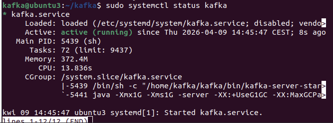
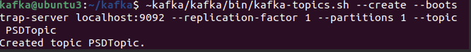
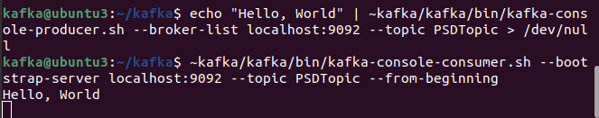
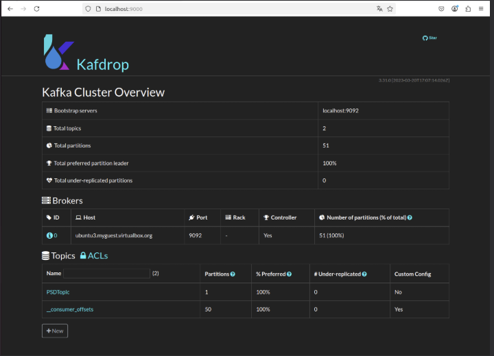
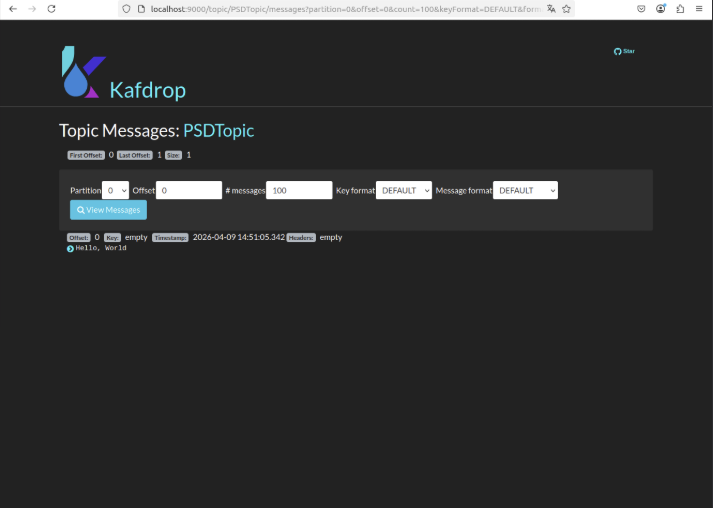

# PSD lab 1
## Uruchomienie i testowanie Apache Kafka

Zgodnie z instrukcją, w pierwszym kroku utworzyłem service kafki.



Następnie wytworzyłem topic:



W celu testowania działania kafki ręcznie wysłałem wiadomość na testowym topic, a następnie odczytałem w konsoli za pomocą uruchomienia konsumenta.



Po uruchomieniu serwisku kafkadrop zobaczyłem swój topic, wchodząc w który mogłem sprawdzić, że wiadomość została poprawnie wysłana i odebrana,






## Wytworzenie własnego producenta i konsumenta
W celu wytworzenia własnego producenta i konsumenta, skorzystałem z przykładowego kodu dostępnego w instrukcji. Zmodyfikowałem go tak, aby producent wysyłał wiadomość o aktualnej temeraturze w singapurze co sekundę, a konsument odbierał te wiadomości i wyświetlał je w konsoli.

Poniżej znajduje się kluczowy kod producenta:
```python
def get_singapore_temperature():
    url = (
        "https://api.open-meteo.com/v1/forecast"
        "?latitude=1.3521&longitude=103.8198"
        "&current=temperature_2m"
    )
    response = requests.get(url, timeout=10)
    response.raise_for_status()
    data = response.json()

    return {
        "city": "Singapore",
        "temperature_c": data["current"]["temperature_2m"],
        "timestamp": datetime.now().isoformat()
    }

if __name__ == "__main__":
    while True:
        try:
            message = get_singapore_temperature()

            print(f'Producing message @ {datetime.now()} | Message = {message}')
            producer.send("messages", message)

        except Exception as e:
            print(f"Error fetching or sending temperature: {e}")

        time.sleep(1)
```

Konsumer pozostał bez znaczących zmian.

